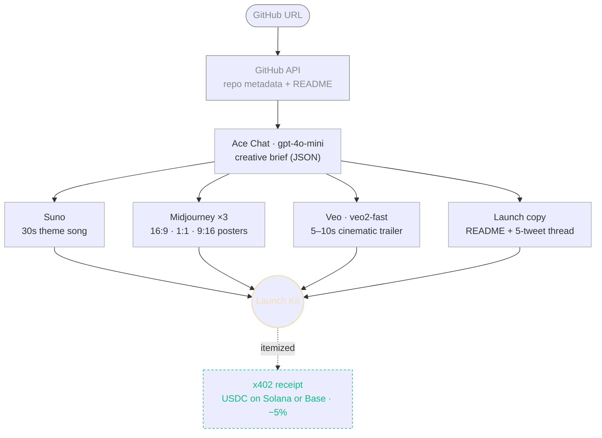

# ShipKit

**Paste a GitHub repo. Get a cinematic trailer, theme song, three posters, and rewritten launch copy — in 60 seconds, for ~$0.50.**

Built on [Ace Data Cloud](https://acedata.cloud). Billed per request via x402 in USDC. No subscriptions, no idle cost.

> **[Try it →](https://shipkit.vercel.app)** · Submission for the Ace Data Cloud Creator & Builder Campaign (April 2026)

---

## What it does

Paste `github.com/owner/repo` → 60 seconds later you have:

- 🎬 **Cinematic trailer** — 5–10s, rendered by Veo (`veo2-fast`) in 16:9
- 🎵 **Theme song** — 30s launch anthem from Suno
- 🎨 **Three posters** — 16:9 hero · 1:1 social · 9:16 stories (Midjourney v6)
- ✍️ **Launch copy** — README rewrite + 5-tweet thread (Ace Chat)
- 💳 **Itemized receipt** — every call costed in USDC, settled via x402

## Pipeline



All four media calls fan out in parallel. Errors isolate per-service — one failure doesn't kill the kit.

## The cost story

| | ShipKit | Subscribe to all four |
|---|---|---|
| **Price** | `$0.50` / kit | `$155` / month |
| Runway | — | `$95` |
| Suno | — | `$10` |
| Midjourney | — | `$30` |
| ChatGPT | — | `$20` |
| **Idle cost** | `$0` | `$155` |
| **Break-even** | 310 kits | — |

Pay with x402 on top-up → instant 5% discount. Hold `$ACE` for further tier discounts.

## Stack

- **Next.js 16.2** (App Router) · **React 19** · **Tailwind v4**
- **Hugeicons** for iconography, **Satoshi** + **Instrument Serif Italic** for type
- **Ace Data Cloud** — Chat (`gpt-4o-mini`) · Suno · Midjourney · Veo
- **x402** — USDC on Solana or Base

Backend is a single Next.js Route Handler at `app/api/generate/route.ts` that orchestrates GitHub → Chat → parallel media fan-out with per-service error isolation.

## Quick start

```bash
cd frontend
npm install
npm run dev
```

Open [localhost:3000](http://localhost:3000). Click **Try now**, paste your Ace API key (the button in the top-right of `/try`), paste a GitHub repo, hit generate.

Your Ace key is stored in `localStorage` on your device — it never leaves the browser except as the `x-ace-token` header on the generation request. [Get one at platform.acedata.cloud](https://platform.acedata.cloud).

### Environment (optional, server-side)

```bash
# frontend/.env.local
ACEDATA_API_TOKEN=ace_...   # fallback if no user key is provided
GITHUB_TOKEN=ghp_...         # bumps GitHub rate limit from 60/hr → 5000/hr
```

## Campaign qualifiers hit

| Qualifier | How |
|---|---|
| **Multi-tool creation** | Chat + Suno + Midjourney + Veo in one pipeline |
| **x402 walkthrough** | [Dedicated payment section](https://shipkit.vercel.app/#pay) + live itemized receipt on every kit |
| **Pay-per-use vs subscription** | [Pricing page](https://shipkit.vercel.app/#pricing) shows `$0.50` vs `$155/mo` with break-even math |
| **Live Nexior deployment** (bonus) | Forked and deployed alongside |

## Repo layout

- [frontend/](frontend/) — Next.js app (pages, API routes, pipeline)
- [frontend/lib/github.ts](frontend/lib/github.ts) — repo URL parsing + metadata/README fetch
- [frontend/lib/ace.ts](frontend/lib/ace.ts) — Ace Chat wrapper (JSON-mode completions)
- [frontend/lib/ace-media.ts](frontend/lib/ace-media.ts) — Suno / Midjourney (NDJSON stream) / Veo wrappers
- [frontend/app/api/generate/route.ts](frontend/app/api/generate/route.ts) — the orchestrator
- [AGENTS.md](AGENTS.md) — full project spec + design system

## Credits

Built for the Ace Data Cloud Creator & Builder Campaign, April 2026.
Tag: `@acedatacloud` · Hashtags: `#BuildWithAce` `#AceDataCloud`
